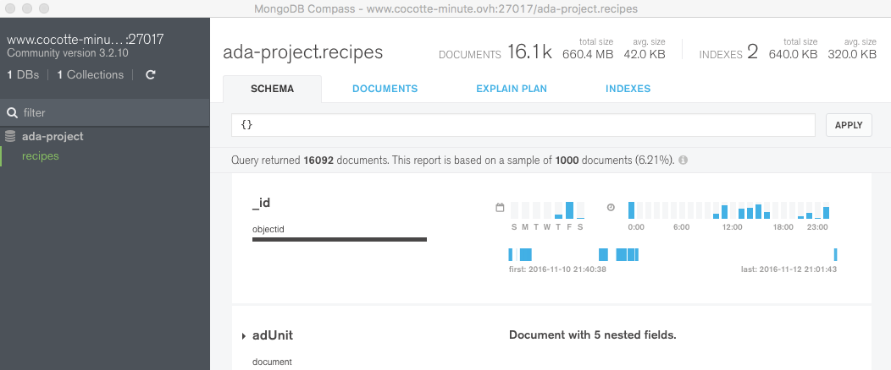

## Notes on the utilisation of MongoDB

<aside class="notice">Be sure you are connect on the **EPFL network** (connection at EPFL or via VPN)</aside>

### Utilisation on Python

The database is hosted on [www.cocotte-minute.ovh](www.cocotte-minute.ovh).
The Mongo Notebook provides a basic implementation to connect to the database
* Your username-password pair has read-only credentials
* Use the admin user to insert, modify, or create indexes

Resources:
* [PyMongo Tutorial](https://api.mongodb.com/python/current/tutorial.html)
* [Mongo Documentation](https://docs.mongodb.com/ecosystem/drivers/python/)

### Utilisation with Mongo Compass

Mongo Compass is a tool to visualize statistics about the collections of documents in the database

* Download Mongo Compass [here](https://www.mongodb.com/products/compass)
* Be sure your are on the **EPFL network**
* Connect to host
    * Hostname: www.cocotte-minute.ovh
    * Port: 27017
    * Authentification: Username / Password
    * Username: <Your username>
    * Password: <Your password>
    * Authentification Database: ada-project
    * SSL: OFF
    * SSH Tunnel: OFF
   
